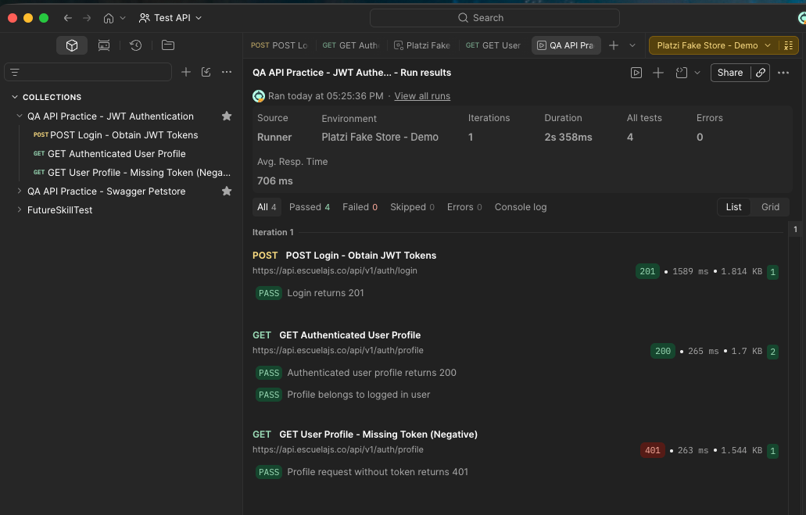

# Postman JWT Authentication API Testing Portfolio

API test automation portfolio demonstrating a JWT authentication flow using Postman and the Platzi Fake Store API.

## Scope

The collection verifies the following authentication scenarios:

1. Valid login returns `201 Created`
2. Login response captures an access token
3. Authenticated user profile returns `200 OK`
4. Returned profile belongs to the logged-in user
5. Profile request without a token returns `401 Unauthorized`

Detailed scenarios: [JWT Authentication Test Cases](docs/test-cases.md)

## Test Flow

```text
POST /auth/login
  -> validate 201
  -> capture access_token into Environment

GET /auth/profile with Bearer token
  -> validate 200
  -> validate returned email

GET /auth/profile without token
  -> validate 401
```

## Project Structure

```text
collections/
  jwt-authentication.postman_collection.json

environments/
  platzi-fake-store.example.postman_environment.json

evidence/
  Collection run evidence will be stored here.

docs/
  Additional test documentation.
```

## Tools and Concepts

- Postman
- REST API testing
- JSON request and response validation
- JWT Bearer Token authentication
- Environment variables
- JavaScript post-response scripts
- Positive and negative test scenarios

## How to Run

1. Import `collections/jwt-authentication.postman_collection.json` into Postman.
2. Import `environments/platzi-fake-store.example.postman_environment.json`.
3. Duplicate the example environment and set `demoEmail` and `demoPassword` locally.
4. Select the completed local environment.
5. Run the collection in this order: Login, Authenticated Profile, Missing Token test.

`accessToken` is generated automatically by the Login request. Do not add real credentials or access tokens to source control.

## Test Evidence

Latest local run: 3 requests, 4 assertions passed, 0 failures.



## API Documentation

- Swagger UI: [Platzi Fake Store API Docs](https://api.escuelajs.co/docs)
- Base URL: `https://api.escuelajs.co/api/v1`
