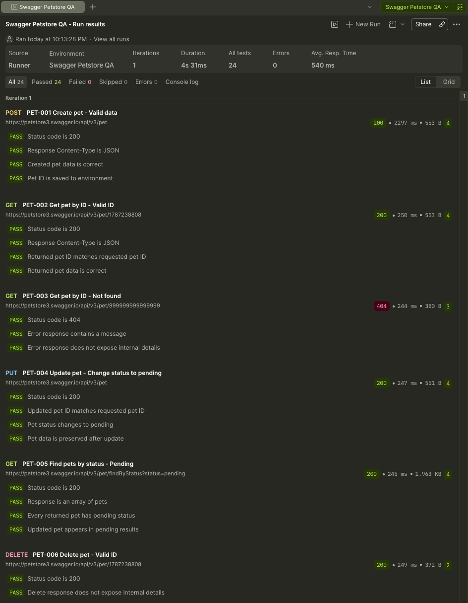
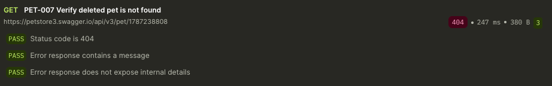

# Postman API Testing Portfolio

Portfolio of API test design and Postman collections. It demonstrates test flows, response assertions, environment-variable handling, and evidence from local collection runs.

## Featured Project: Swagger Petstore QA

An end-to-end Pet lifecycle suite for the public [Swagger Petstore OpenAPI 3.0](https://petstore3.swagger.io/) service.

### What is covered

| Flow | Purpose | Assertions |
| --- | --- | ---: |
| `PET-001` Create pet - Valid data | Create an isolated pet with a dynamic ID and save it as `petId`. | 4 |
| `PET-002` Get pet by ID - Valid ID | Verify the created pet can be retrieved with the saved ID. | 4 |
| `PET-003` Get pet by ID - Not found | Verify a non-existent ID returns the expected `404`. | 3 |
| `PET-004` Update pet - Change status to pending | Update the full resource and verify data is preserved. | 4 |
| `PET-005` Find pets by status - Pending | Verify every returned item is `pending` and includes the updated pet. | 4 |
| `PET-006` Delete pet - Valid ID | Delete the test pet and check that no internal details are exposed. | 2 |
| `PET-007` Verify deleted pet is not found | Confirm that the deletion persists with an expected `404`. | 3 |

The test flow uses Postman post-response scripts to validate status codes, response type and body data. `petId` is captured from `PET-001`, passed through the lifecycle, and cleaned up by `PET-006`.

### Latest recorded local run

| Requests | Assertions | Passed | Failed | Errors |
| ---: | ---: | ---: | ---: | ---: |
| 7 | 24 | 24 | 0 | 0 |



The final negative test confirms the deleted pet is no longer available:



### Files

- [Postman collection](collections/Swagger-Petstore-QA.postman_collection.json)
- [Postman environment](environments/Swagger-Petstore-QA.postman_environment.json)
- [Detailed Swagger Petstore test cases](docs/swagger-petstore-test-cases.md)
- [Swagger Petstore API documentation](https://petstore3.swagger.io/)

### How to run

1. Import `collections/Swagger-Petstore-QA.postman_collection.json` into Postman.
2. Import `environments/Swagger-Petstore-QA.postman_environment.json` and select it as the active environment.
3. Run the whole collection in Collection Runner, in its listed order.
4. Review the results: `PET-003` and `PET-007` intentionally return `404`; their assertions should still pass.

`PET-001` generates a fresh ID and saves `petId` automatically. Run the entire collection rather than starting with a dependent request such as `PET-002` or `PET-006`.

## Additional Project: JWT Authentication API Testing

This collection exercises a login and authenticated-profile flow against the Platzi Fake Store API:

- Valid login captures an access token.
- Authenticated profile verifies `200 OK` and the expected email.
- A request without a token verifies `401 Unauthorized`.

Files:

- [JWT collection](collections/jwt-authentication.postman_collection.json)
- [JWT test cases](docs/test-cases.md)
- [JWT run evidence](evidence/jwt-authentication-run-4-passed.png)

## Tools and Testing Practices

- Postman and Collection Runner
- REST API and JSON response validation
- Positive and negative test scenarios
- Environment variables and dynamic test data
- JavaScript post-response assertions
- CRUD lifecycle and state verification
- Safe public-API cleanup after test execution

## Project Structure

```text
collections/   Postman collections ready to import
environments/  Non-secret example environments
docs/          Test design and scenario documentation
evidence/      Screenshots of local collection-run results
```

## Notes

- This repository contains test assets and locally verified collection-run evidence; it does not claim CI execution or production-system testing.
- The Swagger Petstore service is public and shared. Dynamic IDs help reduce collision with other users' test data.
- Do not commit credentials, real access tokens, or other secrets to an environment file.
